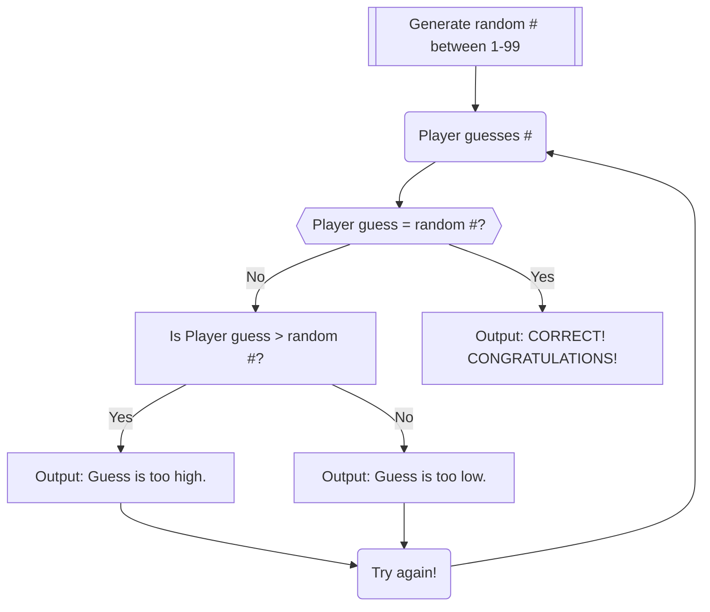

### Description
* In this game, a random number between 1 and 99 is generated and then the player has to guess what that number is. 
* If the guess is higher than the generated number, the output will indicate "too high" and instruct the player to guess again.
* If the guess is lower than the generated number, the output will indicate "too low" and instruct the player to guess again.
* This loop will repeat until the player's guess matches the generataed number.
* If / when the guess is the generated number, the output will indicate "CORRECT! CONGRATULATIONS!"
* In this scenario, the player would be aware of the range of digits beforehand so there should be no issue with guessing outside the range of numbers programmed. 
